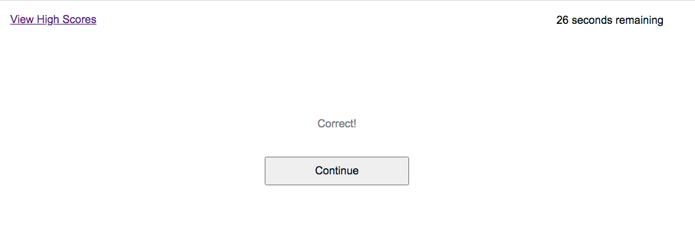
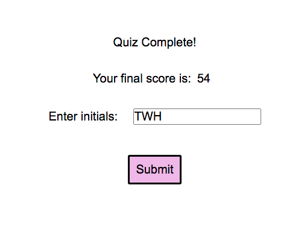

# coding-quiz

Summary:
 
The objective of this application is to quiz the user on their knowledge of code-related content. This quiz was developed using principles of Git, HTML, CSS, and Javascript. A final result is delivered based upon how much time is remaining after she/he completes the quiz. This result or final score is displayed in a separate high score window with their initials. All files were independently written. Please render using Chrome. (apologies as the scoring system is currently bugged at some points during the application)

 

Breakdown:
 
Upon reading the quiz's instructions and with a little mental preparation, the user can click the "Start Quiz" button. She/he is then prompted to answer three coding-related questions in a multiple choice format within a given time limit of 60 seconds. Answering correctly has no effect on remaining time/score, while answering incorrectly reduces the timer/score by 3 seconds. Once the three questions are answered or the time remaining ends the user is assigned a score, which they can attach their initials to. Their initials and score are then stored and displayed onto a high scores window. The user can repeatedly take the quiz to earn a faster time or higher score. 

 

Application URL:
 
Check out the deployed application here: https://tedheikkila.github.io/coding-quiz/
 

 
Screenshots:
 

